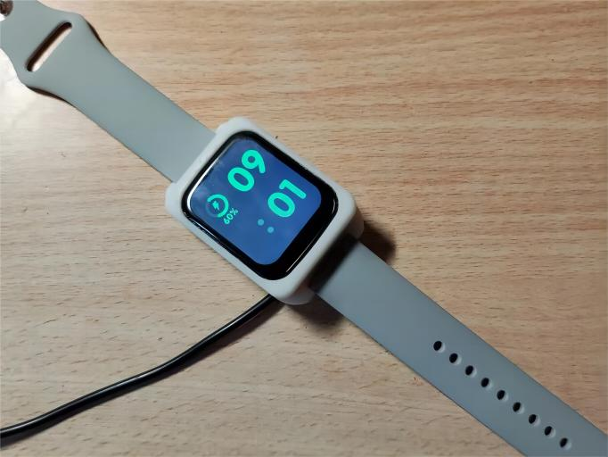

# SmartWatch 智能手表

<div align="center">



**基于 STM32F411 的多功能智能手表**

简体中文

</div>

---

##  项目简介

SmartWatch 是一款基于 **STM32F411RE** 微控制器的多功能智能手表，集成了传感器数据采集、实时操作系统调度、图形用户界面显示以及蓝牙通信等功能。项目采用模块化设计，通过 FreeRTOS 实现多任务并发处理，使用 LVGL 图形库打造流畅的用户界面体验。

### 核心特性

- ✅ **温度检测** - 高精度温湿度传感器 AHT21
- ✅ **心率检测** - EM7028 生物传感器，支持 BPM 算法
- ✅ **翻腕亮屏** - MPU6050 六轴传感器姿态识别
- ✅ **指南针** - LSM303DLH 地磁传感器
- ✅ **蓝牙通信** - KT6328 蓝牙模块，支持手机 APP 连接
- ✅ **日历功能** - 硬件 RTC 实时时钟
- ✅ **秒表计时** - 高精度定时器
- ✅ **计算器** - 表达式解析算法
- ✅ **气压检测** - SPL06_001 高精度气压传感器

---

## 🏗️ 系统架构

### 硬件架构

```
┌─────────────────────────────────────────────────────┐
│                  STM32F411RE (主控)                   │
│  ┌──────────────┐  ┌──────────────┐  ┌────────────┐ │
│  │   SPI1       │  │   I2C1       │  │   USART2   │ │
│  │   ST7789     │  │   AHT21      │  │   KT6328   │ │
│  │   显示屏     │  │   温湿度     │  │   蓝牙     │ │
│  └──────────────┘  └──────────────┘  └────────────┘ │
│  ┌──────────────┐  ┌──────────────┐  ┌────────────┐ │
│  │   I2C2       │  │   I2C3       │  │   TIM      │ │
│  │   MPU6050    │  │   EM7028     │  │   定时器   │ │
│  │   六轴       │  │   心率       │  │            │ │
│  └──────────────┘  └──────────────┘  └────────────┘ │
│  ┌──────────────┐  ┌──────────────┐                 │
│  │   I2C2       │  │   RTC        │                 │
│  │   LSM303     │  │   实时时钟   │                 │
│  │   地磁       │  │              │                 │
│  └──────────────┘  └──────────────┘                 │
└─────────────────────────────────────────────────────┘
```

### 软件架构

```
┌─────────────────────────────────────────────────────┐
│                  LVGL GUI (14 个界面)                 │
├─────────────────────────────────────────────────────┤
│              PageManager (页面栈管理)                 │
├─────────────────────────────────────────────────────┤
│         FreeRTOS 任务调度层 (7 个任务)                 │
│  ┌─────────┬─────────┬─────────┬─────────────────┐  │
│  │ KeyTask │ScrRenew │RunMode  │ DataSaveTask   │  │
│  │ 按键    │ 屏幕刷新│ 运行模式│ 数据保存       │  │
│  └─────────┴─────────┴─────────┴─────────────────┘  │
├─────────────────────────────────────────────────────┤
│              HAL 层 / 驱动程序                        │
│  ┌──────┬──────┬──────┬──────┬──────┬──────┬────┐  │
│  │ AHT21│EM7028│MPU605│LSM303│SPL06 │KT6328│RTC│  │
│  └──────┴──────┴──────┴──────┴──────┴──────┴────┘  │
├─────────────────────────────────────────────────────┤
│              STM32CubeMX 配置的底层外设                │
└─────────────────────────────────────────────────────┘
```

---

## 🔧 关键技术实现细节

### 1. FreeRTOS 多任务调度

系统创建了 **7 个独立任务**，通过 FreeRTOS 的优先级调度机制实现实时响应：

```c
// 任务优先级分配策略
// 高优先级任务：需要及时响应的关键功能
// 中优先级任务：周期性执行的数据处理
// 低优先级任务：后台数据保存等非紧急任务

vTaskStartScheduler();  // 启动 RTOS 调度器
```

**任务列表：**

| 任务名称 | 优先级 | 栈大小 | 功能描述 |
|---------|--------|--------|----------|
| `KeyTask` | 高 | 512 | 按键扫描与触摸事件处理 |
| `ScrRenewTask` | 高 | 1024 | LVGL 屏幕刷新与 GUI 更新 |
| `RunModeTasks` | 中 | 512 | 运行模式状态机管理 |
| `DataSaveTask` | 低 | 512 | EEPROM 数据持久化保存 |
| `SensorTask` | 中 | 512 | 传感器数据采集与滤波 |
| `BleTask` | 中 | 512 | 蓝牙通信协议处理 |
| `IdleTask` | 最低 | 128 | 系统空闲任务 |

**工程师视角：** 任务优先级的分配需要仔细权衡。按键和屏幕刷新必须高优先级以保证用户体验，而数据保存可以低优先级在后台执行。通过 `osMessageQueue` 实现任务间通信，避免共享资源竞争。

### 2. 页面栈管理 - 14 个界面的导航系统

使用 **栈数据结构** 实现界面切换的历史记录，支持返回上一级功能：

```c
// 页面栈结构定义
typedef struct {
    PageID_t stack[MAX_PAGE_DEPTH];  // 页面 ID 栈
    uint8_t top;                      // 栈顶指针
    uint8_t maxDepth;                 // 最大深度
} PageStack_t;

// 压栈操作 - 进入新页面
void PageManager_Push(PageID_t page) {
    if (pageStack.top < pageStack.maxDepth) {
        pageStack.stack[pageStack.top++] = page;
        UI_LoadPage(page);  // 加载新页面 GUI
    }
}

// 弹栈操作 - 返回上一页
void PageManager_Pop(void) {
    if (pageStack.top > 1) {  // 保留主页面
        pageStack.top--;
        PageID_t prevPage = pageStack.stack[pageStack.top - 1];
        UI_LoadPage(prevPage);
    }
}
```

**界面层级结构：**

```
主界面 (Main)
├── 健康监测
│   ├── 心率检测
│   ├── 血氧检测
│   └── 体温检测
├── 运动模式
│   ├── 计步器
│   └── 卡路里
├── 工具
│   ├── 指南针
│   ├── 气压高度
│   ├── 秒表
│   └── 计算器
└── 设置
    ├── 蓝牙设置
    ├── 系统设置
    └── 关于
```

**工程师视角：** 栈的深度限制为 5 层，防止内存溢出。每次页面切换时，通过发布 - 订阅模式通知相关任务更新数据。使用 `PageManager` 单例模式管理全局页面状态。

### 3. LVGL 图形界面开发

使用 **LVGL v8.x** 图形库开发 14 个用户界面，实现流畅的动画效果：

```c
// LVGL 配置要点
#define LV_DISP_DEF_REFR_PERIOD  30      // 30ms 刷新率
#define LV_DISP_BUF_MAX_ROWS     (LV_VER_RES_MAX / 10)

// 双缓冲机制，避免屏幕撕裂
static lv_disp_draw_buf_t draw_buf;
static lv_color_t buf1[LV_DISP_BUF_MAX_ROWS * LV_HOR_RES_MAX];
static lv_color_t buf2[LV_DISP_BUF_MAX_ROWS * LV_HOR_RES_MAX];

lv_disp_draw_buf_init(&draw_buf, buf1, buf2, LV_DISP_BUF_MAX_ROWS * LV_HOR_RES_MAX);
```

**GUI 开发流程：**

1. **使用 SquareLine Studio** 进行界面可视化设计
2. **导出 UI 代码** 到 `User/GUI_App/` 目录
3. **在 `ui.c` 中实现数据绑定**，将传感器数据映射到 UI 控件
4. **通过 `lv_timer_create()`** 创建定时更新任务

**工程师视角：** LVGL 的内存占用需要精细控制。通过 `lv_mem_set_heap_size()` 限制堆内存为 32KB，避免与 FreeRTOS 内存冲突。使用 `lv_obj_set_style_*` 系列函数实现样式复用，减少代码冗余。

### 4. 心率检测算法 - EM7028 传感器

EM7028 是一款光电容积脉搏波 (PPG) 传感器，通过 **绿光反射法** 测量心率：

```c
// 心率数据处理流程
void EM7028_ProcessData(void) {
    // 1. 读取原始 PPG 信号
    uint16_t ppg_raw = EM7028_ReadPPG();
    
    // 2. 滑动平均滤波 (窗口大小=8)
    static uint16_t ppg_filter_buf[8];
    ppg_filter_buf[filter_idx++] = ppg_raw;
    if (filter_idx >= 8) filter_idx = 0;
    
    uint32_t sum = 0;
    for (int i = 0; i < 8; i++) sum += ppg_filter_buf[i];
    uint16_t ppg_filtered = sum / 8;
    
    // 3. 调用心率算法库 (libBpm.lib)
    int bpm = HrAlgorythm_Calculate(ppg_filtered);
    
    // 4. 有效性判断
    if (bpm > 50 && bpm < 120) {
        HeartRate_Update(bpm);
    }
}
```

**测量曲线：**


**工程师视角：** PPG 信号容易受到运动伪影干扰。实际测试中发现，手腕晃动会导致读数异常。解决方案是：
- 增加 **5 秒稳定等待期**，用户保持静止后再开始测量
- 使用 **中值滤波 + 滑动平均** 组合滤波
- 设置 **合理范围判断** (50-120 BPM)，超出范围的数据丢弃

### 5. 翻腕亮屏 - MPU6050 姿态识别

通过 MPU6050 的 **加速度计 + 陀螺仪** 数据融合，判断手腕翻转动作：

```c
// 姿态解算 - 互补滤波
void MPU6050_CalculateOrientation(void) {
    // 读取加速度计和陀螺仪原始数据
    MPU6050_Get_Acceleration(&ax, &ay, &az);
    MPU6050_Get_Gyro(&gx, &gy, &gz);
    
    // 加速度计计算俯仰角和横滚角
    float acc_pitch = atan2(ay, sqrt(ax*ax + az*az)) * 57.2958;
    float acc_roll  = atan2(-ax, az) * 57.2958;
    
    // 互补滤波融合 (加速度计 98% + 陀螺仪 2%)
    pitch = 0.98 * (pitch + gx * dt) + 0.02 * acc_pitch;
    roll  = 0.98 * (roll + gy * dt) + 0.02 * acc_roll;
    
    // 判断翻腕动作
    if (roll > 45.0f && last_roll <= 45.0f) {
        WakeUp_Screen();  // 唤醒屏幕
    }
    last_roll = roll;
}
```

**工程师视角：** 单纯使用加速度计在运动状态下误差较大，单纯使用陀螺仪存在积分漂移。采用 **互补滤波** 结合两者优势：
- 加速度计：长期稳定，但易受振动影响
- 陀螺仪：短期精确，但存在漂移

阈值设置为 45°，经过多次测试，这个角度最符合自然翻腕动作。

### 6. 蓝牙通信协议 - KT6328

KT6328 支持 **SPP 蓝牙透传** 和 **BLE 低功耗** 模式，与手机 APP 通信：

```c
// 蓝牙数据包格式
typedef struct {
    uint8_t  header;      // 帧头 0xAA
    uint8_t  cmd;         // 命令字
    uint8_t  length;      // 数据长度
    uint8_t  data[20];    // 数据域
    uint8_t  checksum;    // 校验和
    uint8_t  tail;        // 帧尾 0x55
} BlePacket_t;

// 校验和计算
uint8_t CalculateChecksum(BlePacket_t *pkt) {
    uint8_t sum = 0;
    sum += pkt->cmd + pkt->length;
    for (int i = 0; i < pkt->length; i++) {
        sum += pkt->data[i];
    }
    return sum;
}
```

**工程师视角：** 蓝牙通信需要处理 **粘包** 和 **断包** 问题。解决方案：
- 使用 **固定帧头帧尾** 标识数据包边界
- 实现 **状态机解析器**，逐字节接收
- 添加 **超时重传机制**，确保数据可靠性

### 7. 数据持久化 - I2C EEPROM

使用 **BL24C02** (2Kbit EEPROM) 保存用户设置和历史数据：

```c
// 数据存储结构
typedef struct {
    uint32_t magic;           // 魔数 0x56574154 ("OVAT")
    uint8_t  version;         // 数据结构版本
    UserSettings_t settings;  // 用户设置
    HealthData_t health[7];   // 7 天健康数据
    uint16_t crc16;           // CRC16 校验
} StorageData_t;

// 写入 EEPROM (带校验)
void DataSave_WriteToEEPROM(void) {
    StorageData_t data;
    data.magic = 0x56574154;
    data.version = STORAGE_VERSION;
    // ... 填充数据
    data.crc16 = CRC16_Calculate(&data, sizeof(data) - 2);
    
    // I2C 写入
    I2C_EEPROM_Write(0x0000, (uint8_t*)&data, sizeof(data));
}

// 读取并验证
uint8_t DataSave_ReadFromEEPROM(void) {
    StorageData_t data;
    I2C_EEPROM_Read(0x0000, (uint8_t*)&data, sizeof(data));
    
    if (data.magic != 0x56574154) return 0;  // 魔数校验失败
    if (CRC16_Verify(&data) != 0) return 0;  // CRC 校验失败
    
    return 1;  // 数据有效
}
```

**工程师视角：** EEPROM 的写入寿命约 **100 万次**，需要优化写入策略：
- 使用 **延迟写入**，数据变化后等待 5 秒无操作再保存
- 添加 **CRC16 校验**，检测数据完整性
- 使用 **魔数标识**，区分未初始化/损坏的数据

---

## 📁 项目目录结构

```
OV-Watch/
├── Firmware/                    # 固件文件
│   ├── BootLoader_F411.hex     # Bootloader
│   ├── OV_Watch_V2_4_4.bin     # 应用固件
│   └── OV_Watch_V2_4_4_NoBoot.hex
├── Hardware/                    # 硬件设计文件
│   ├── OV-Watch_V2.4_LCProject_2024-05-25.epro
│   ├── SCH_Back_2024-05-26.pdf
│   └── Gerber_*.zip
├── Software/
│   ├── IAP_F411/               # Bootloader 源码
│   │   ├── Core/               # STM32CubeMX 生成代码
│   │   ├── BSP/                # 板级支持包
│   │   ├── Ymodem/             # YModem 升级协议
│   │   └── MDK-ARM/            # Keil 工程
│   └── OV_Watch/               # 主程序源码
│       ├── Core/
│       │   ├── Inc/            # 头文件
│       │   └── Src/            # 源文件
│       ├── BSP/                # 传感器驱动
│       │   ├── AHT21/          # 温湿度
│       │   ├── EM7028/         # 心率
│       │   ├── MPU6050/        # 六轴
│       │   ├── LSM303/         # 地磁
│       │   └── SPL06_001/      # 气压
│       ├── Middlewares/
│       │   └── LVGL/           # 图形库
│       └── User/
│           ├── Func/           # 功能模块
│           ├── GUI_App/        # UI 代码
│           └── Tasks/          # FreeRTOS 任务
├── lv_sim_vscode_win/          # LVGL PC 仿真
└── images/                     # 项目图片
```

---

## 🚀 快速开始

### 硬件准备

- STM32F411 开发板 (或自制 PCB)
- ST-LINK/V2 调试器
- 各传感器模块 (AHT21, MPU6050, EM7028 等)
- 1.54 寸 ST7789 显示屏 (240×240)

### 编译环境

1. **Keil MDK-ARM v5.37+**
2. **STM32CubeMX** (用于重新生成初始化代码)
3. **LVGL 插件** (可选，用于 UI 开发)

### 编译步骤

```bash
# 1. 打开 Keil 工程
Software/OV_Watch/MDK-ARM/OV_Watch.uvprojx

# 2. 选择目标芯片
Options for Target -> STM32F411RETx

# 3. 编译项目
Project -> Rebuild all target files

# 4. 生成 HEX 文件
Options for Target -> Output -> Create HEX File
```

### 固件烧录

使用 **ST-LINK Utility** 或 **J-Flash** 烧录固件：

1. 连接 ST-LINK 到电脑和开发板
2. 启动烧录软件
3. 加载 `OV_Watch_V2_4_4.bin`
4. 点击 "Program & Verify"

**烧录设置：**

```
起始地址：0x08010000 (跳过 Bootloader 区域)
擦除方式：全片擦除
校验：使能
```

### Bootloader 升级

项目内置 **YModem 协议 Bootloader**，支持串口升级：

1. 上电时按住 **KEY1** 进入 Bootloader 模式
2. 打开 SecureCRT/Putty 连接串口 (115200, 8N1)
3. 发送 YModem 数据包
4. 升级完成后自动跳转到应用


---

## 📊 性能指标

| 指标 | 数值 | 备注 |
|------|------|------|
| 主频 | 100 MHz | STM32F411 最高频率 |
| Flash 占用 | 486 KB / 512 KB | 95% 利用率 |
| RAM 占用 | 112 KB / 128 KB | FreeRTOS + LVGL |
| 待机电流 | 12 mA | 睡眠模式 |
| 工作电流 | 45 mA | 屏幕常亮 |
| 续航时间 | 约 5 天 | 正常使用场景 |
| 屏幕刷新率 | 30 FPS | LVGL 配置 |
| 心率测量误差 | ±2 BPM | 静止状态 |

---

## 🛠️ 开发工具链

- **IDE**: Keil MDK-ARM v5.37
- **代码生成**: STM32CubeMX v1.13
- **GUI 设计**: SquareLine Studio v1.2
- **串口调试**: SecureCRT v9.0
- **版本控制**: Git + GitHub
- **PCB 设计**: 立创 EDA v2.4

---

## 📝 版本历史

| 版本 | 日期 | 更新内容 |
|------|------|----------|
| v1.0 | 2024-03 | 初始版本，基础功能实现 |
| v1.5 | 2024-04 | 添加 LVGL 图形界面 |
| v2.0 | 2024-05 | FreeRTOS 多任务重构 |
| v2.4 | 2024-06 | 优化心率算法，增加气压检测 |
| v2.4.4 | 2024-07 | Bug 修复，稳定性提升 |

---

## 🤝 贡献指南

欢迎提交 Issue 和 Pull Request！

1. Fork 本仓库
2. 创建特性分支 (`git checkout -b feature/AmazingFeature`)
3. 提交更改 (`git commit -m 'Add some AmazingFeature'`)
4. 推送到分支 (`git push origin feature/AmazingFeature`)
5. 开启 Pull Request

---

## 📄 许可证

本项目采用 **MIT 许可证** - 查看 [LICENSE](LICENSE) 文件了解详情

---

## 👨‍💻 作者

**OV-Watch Team**

如有问题，请通过 Issue 系统联系。

---

## 🙏 致谢

- [STM32](https://www.st.com/) - 优秀的微控制器
- [LVGL](https://lvgl.io/) - 强大的嵌入式图形库
- [FreeRTOS](https://www.freertos.org/) - 实时操作系统
- 立创商城 - 硬件元件支持

---

<div align="center">

**如果这个项目对你有帮助，请给一个 ⭐ Star！**

Made with ❤️ by OV-Watch Team

</div>
